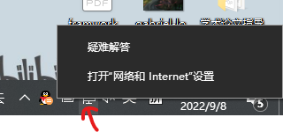
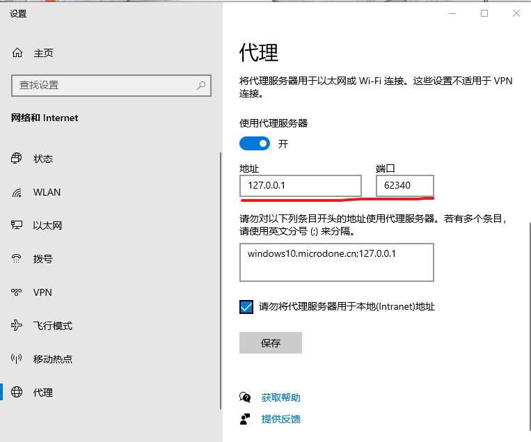
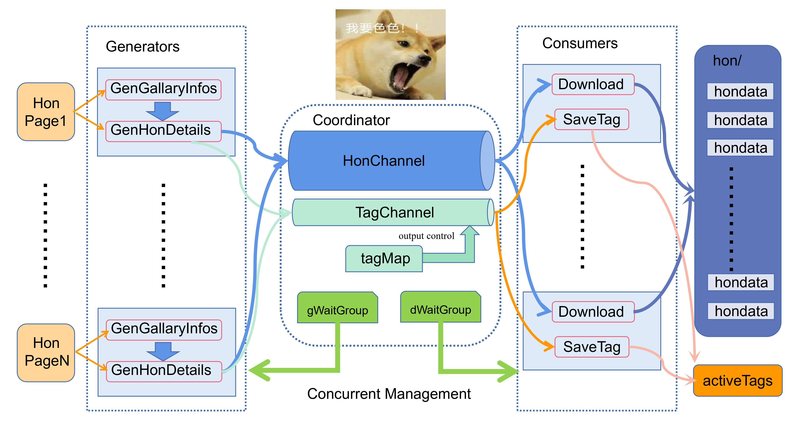

# gentlemanSpider

[](https://github.com/gojp/goreportcard/blob/master/LICENSE)

> *Get some Ero-Hons my friends！GKD!GKD！——Cheems*

## 用途：

- 爬取并保存网站 [绅士漫画](https://www.wnacg.com) 的本子/色图（大陆用户要求在梯子的环境下使用）
- 支持按照配置进行多线程(协程)加速
- 支持按照配置对个人喜好的xp标签进行过滤（可用标签在项目下的`activeTags`文件夹中可查看）

## 项目构建：

### 直接下载发布版本（推荐）

提供的版本类型：

| OS          | ARCH          |
| ----------- | ------------- |
| Linux       | x86/amd64/arm |
| Windows     | x86/amd64     |
| Darwin(Mac) | amd64         |

在 [Release v0.0.1](https://github.com/Youngkingman/gentlemanSpider/releases/tag/v0.0.1) 页面下载压缩包解压后按后续说明编写配置，之后运行可执行文件即可。

### 直接构建（推荐）

在`go1.16`以上的环境下，中文用户参考 [Go下载 ](https://studygolang.com/dl)进行`golang`环境安装。

完成后执行如下操作运行爬虫程序：

```bash
git clone https://github.com/Youngkingman/gentlemanSpider.git
go mod download
go build
./gentlemanSpider
```

### 使用docker进行构建（不推荐）

要求系统装有`docker`，测试版本为`20.10.17`。首先创建容器相关的挂载目录：

```shell
cd /home && mkdir hondata
```

工作目录下克隆本仓库，在`Dockerfile`同级目录下运行：

```shell
git clone https://github.com/Youngkingman/gentlemanSpider.git
docker build -t gspider:latest .
docker run -d --name gspider -v /home/hondata:/goapp --network host gspider:latest
```

上述命令启动镜像并将内部项目的`/goapp`文件夹映射到宿主机`/home/hondata`文件夹与宿主机共享网络进行下载，还没有测试过翻墙条件下是否可用，该方法酌情使用。

### 使用`go`相关工具

在你自己的`golang`项目中使用`go get -u github.com/Youngkingman/gentlemanSpider`命令，只要导入包输入下面的代码就可以引用了：

```golang
import "github.com/Youngkingman/gentlemanSpider/honcrawler"
func main() {
	honcrawler.Coordinator.Start()
}
```

除此以外你还可以根据导出函数自己定制并发逻辑，具体参考实现部分。

## 项目配置使用说明：

项目需要在可执行文件所在同级文件夹下新建一个`config.yaml`文件，可以直接克隆本仓库进行使用，发布版本压缩包中自带该文件。

```yaml
CrawlerSetting:
  PageStart: 2
  PageEnd: 10
  EnableProxy: true
  ProxyHost: http://127.0.0.1:62340
  TagConsumerCount: 2
  HonConsumerCount: 4
  HonBuffer: 32
  TagBuffer: 32
  EnableFilter: false
  WantedTags:
    - 百合
    - 女同士
```

- `PageStart`: 最小为 1 爬虫开始页面，浏览 [这里](https://www.wnacg.com/albums-index-page-1.html)查看最大页数
- `PageEnd`: 最小为 1， 必须**大于等于** `PageStart`，爬虫结束页面，同上浏览 [这里](https://www.wnacg.com/albums-index-page-1.html)查看最大页数（截至写这句话是7104页）
- `EnableProxy`: 是否使用代理（使用需要填写`ProxyHost`)，大陆用户填`true`，海外用户填`false`
- `ProxyHost`: 查看自己电脑的代理，需要带上端口
- `TagConsumerCount`: 用于收集本子标签的配置，配置完成后会在可执行文件同级目录下创建包含所有标签(`xp`/作者/是否彩页汉化)信息的`activeTag`文件，会一定程度减慢本子的下载，不需要可以设置为0
- `HonConsumerCount`:必须大于 0，根据程序运行电脑的配置进行设置
- `HonBuffer`:必须大于 0，
- `TagBuffer`:若设置了 `TagConsumerCount`则 必须大于 0
- `EnableFilter`:是否使用标签过滤，`true`为使用，`false`会默认不过滤爬取所有本子
- `WantedTags`: 你的标签集，需要`EnableFilter`为`true`，每行以`- {yourXP}`的形式对标签进行选取，可以在`activeTag`文件中选取自己所需的标签，最终下载的本子至少会具有你给出的标签集中的一个标签（标签给的越少下载的本子一般会越少）

## 如何查看自己电脑的代理服务器端口(Win)

Linus用户请自行探索翻墙**后**设置。对于windows用户，在你**已经开启了梯子**的情况下（既然你上了`github`那么大概率已经开了）:

1. 右键右下角工具栏网络图标，选择网络和Internet设置

   ​	

2. 左侧选择代理，查找端口地址，如下图则为`http://127.0.0.1:62340`

   

将你得到的对应地址填入`config.yaml`对应的`ProxyHost`配置即可。

## 并发数的选取以及并发架构介绍

如果懒得了解具体实现的话可以使用推荐配置（即项目中默认值），大体适用于6核12线程机器，查看自己机器的核数等比例增加减少即可。并发核心在于以下四个参数：

```yaml
TagConsumerCount: 2
HonConsumerCount: 4
HonBuffer: 32
TagBuffer: 32
```

程序为典型的生产/消费者模型。

- 生产者：生产则会是根据你的页面爬取范围来选择的，一个页面20个本子为一个生产者，一般来说生产速度会远大于消费速度（请求图片`url`并向本地写入图片的`I/O`远远比获取图片地址信息慢），所以消费者的个数决定了你最终的爬取速度，`HonBuffer`和`TagBuffer`为管道缓冲区大小，生产者生产的信息会在管道中暂时存储等候消费者获取。
- 消费者：消费者个数由使用者决定，为`HonConsumerCount`，主要负责根据图片信息下载图片并写入本地文件，这部分的`I/O`操作是最重的，意味着大部分机器时间会由消费者耗费，越多的消费者对于速度的提升理论上会更好，当然这也看你本身的机器硬件（具体配置待我好好研究）。

下面是整体的设计图：



